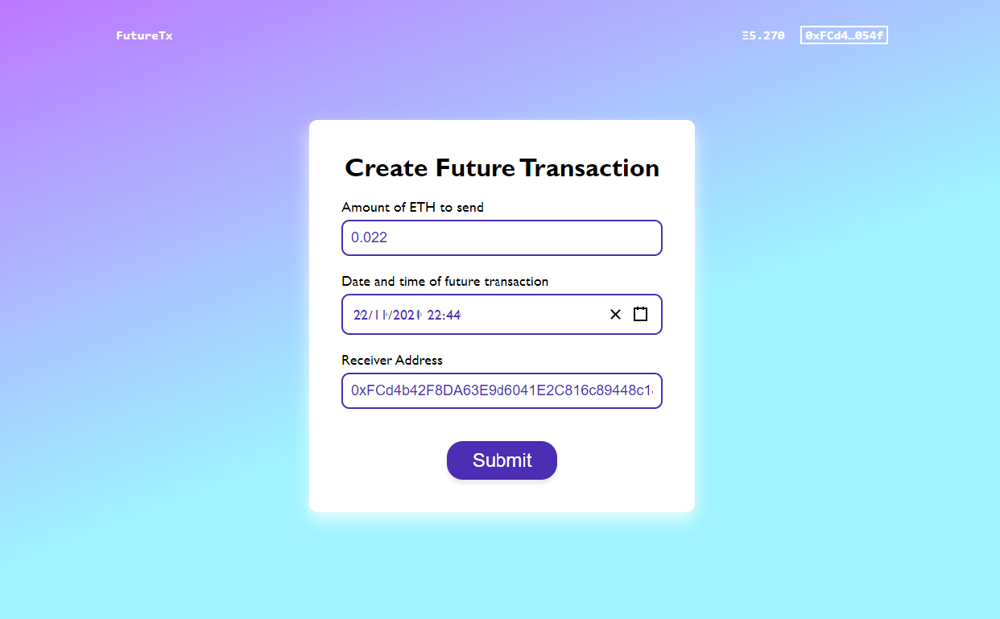

# Web3 Exercise

The original requirement is on [this repository](https://github.com/Autonomy-Network/frontend-live-challenge). I decided to learn how to interact with Solidity smart contract by working on it.

## Getting Started

First, run the development server:

```bash
npm run dev
# or
yarn dev
```

Open [http://localhost:3000](http://localhost:3000) with your browser to see the result.

You can start editing the page by modifying `pages/index.js`. The page auto-updates as you edit the file.